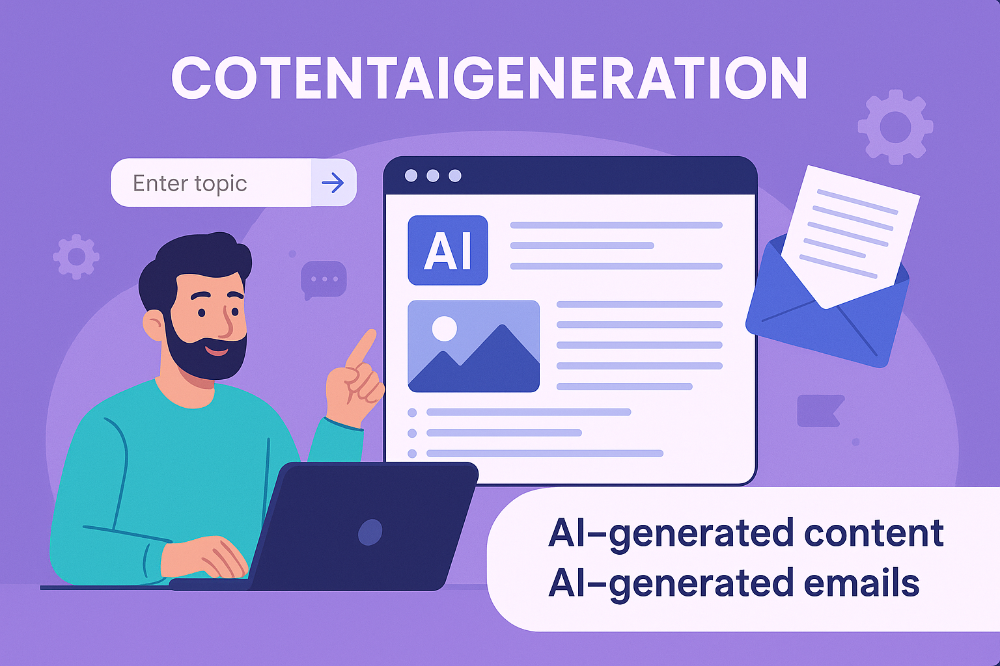
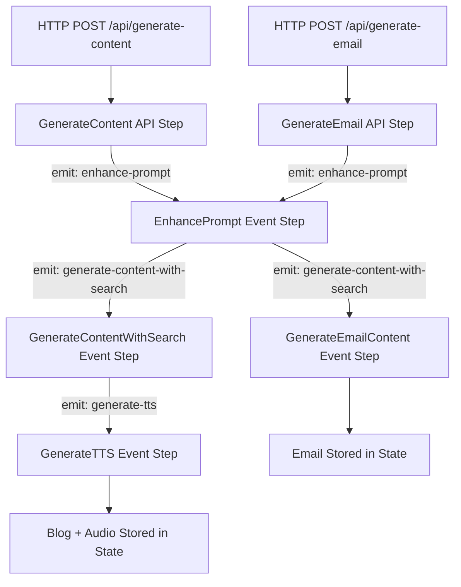

# AI Copywrite

<div align="center">
  

  <p><strong>AI-Powered Content Generation Platform</strong></p>
  <p>Create high-quality blog articles and marketing emails using Google's Gemini AI with integrated search capabilities, text-to-speech audio generation, and email delivery.</p>

  
  
  
  
  
</div>

---

## Live Demo

**[View Live Application](https://cotentaigeneration.vercel.app/)** (Update with your deployed URL)

---

## Features

- **AI-Powered Blog Generation** - Create comprehensive blog articles with 8 content templates (How-to, Listicles, Tutorials, Comparisons, Opinion, News, Guides, Case Studies)
- **Email Content Creation** - Generate marketing emails, cold outreach, newsletters, and follow-ups with industry-specific language
- **Google Search Integration** - Enhanced content with real-time web research and competitive analysis
- **Text-to-Speech Audio** - Automatic audio generation for blog posts using Gemini TTS (24kHz, professional voice)
- **Customization Options** - 6 tone styles, 6 writing styles, adjustable word count (100-10,000), and section configuration
- **Email Optimization** - A/B testing with 5 alternative subject lines, preheader text, HTML/plain-text versions
- **User Dashboard** - Manage, edit, search, and export all generated content
- **Email Delivery** - Send blog posts directly via Resend email service
- **Authentication** - Secure OAuth-based authentication with Stack Auth
- **Multi-User Support** - Per-user content isolation with PostgreSQL database

---

## Technology Stack

### Frontend
- **Framework**: Next.js 16.0.1 with React 19.2.0
- **Language**: TypeScript 5
- **Styling**: Tailwind CSS 4 with PostCSS
- **Animation**: Framer Motion 12.23.24
- **Forms**: React Hook Form 7.66.0 with Zod validation
- **Authentication**: Stack Auth (@stackframe/stack)
- **UI Components**: Custom components with shadcn/ui patterns
- **Icons**: Lucide React, Tabler Icons, React Icons

### Backend
- **Framework**: Motia 0.8.3 (event-driven, type-safe backend framework)
- **Language**: TypeScript 5.7.3
- **Runtime**: Node.js
- **Plugins**:
  - @motiadev/plugin-endpoint (API endpoints)
  - @motiadev/plugin-states (State management)
  - @motiadev/plugin-logs (Logging)
  - @motiadev/plugin-observability (Monitoring)

### AI Services
- **Primary LLM**: Google Gemini 2.5-Pro with extended thinking
- **SDK**: @google/genai 1.28.0
- **Features**:
  - Blog content generation with Google Search integration
  - Email content generation with industry-specific language
  - Text-to-Speech using gemini-2.5-flash-preview-tts
  - Unlimited reasoning budget for extended thinking

### Database
- **Database**: PostgreSQL (Neon serverless)
- **ORM**: Drizzle ORM 0.44.7
- **Authentication**: Neon Auth (automatic user sync)
- **Tables**: `blog_posts`, `neon_auth.users_sync`

### Additional Services
- **Email Provider**: Resend 6.4.0
- **Audio Processing**: lamejs 1.2.1 (MP3 encoding)
- **Validation**: Zod 3.24.4 (schema validation)

---

## Quick Start

### Prerequisites
- Node.js (v18 or higher)
- PostgreSQL database (Neon account recommended)
- Google Gemini API key
- Resend API key
- Stack Auth credentials

### Installation

1. **Clone the repository**
   ```bash
   git clone https://github.com/yourusername/aicopywrite.git
   cd aicopywrite
   ```

2. **Install dependencies**
   ```bash
   # Backend
   npm install

   # Frontend
   cd frontend
   npm install
   cd ..
   ```

3. **Configure environment variables**

   **Backend** (`.env`):
   ```env
   GEMINI_API_KEY=your_gemini_api_key
   RESEND_API_KEY=your_resend_api_key
   RESEND_FROM_EMAIL=your_sender_email@domain.com
   DATABASE_URL=postgresql://your_neon_connection_string
   NODE_ENV=development
   APP_PORT=3000
   ```

   **Frontend** (`frontend/.env.local`):
   ```env
   NEXT_PUBLIC_BACKEND_URL=http://localhost:3000
   NEXT_PUBLIC_STACK_PROJECT_ID=your_stack_project_id
   NEXT_PUBLIC_STACK_PUBLIC_KEY=your_stack_public_key
   ```

4. **Run database migrations**
   ```bash
   cd frontend
   npm run db:push
   ```

5. **Start the application**
   ```bash
   # Terminal 1: Start backend
   npm run dev

   # Terminal 2: Start frontend
   cd frontend
   npm run dev
   ```

6. **Access the application**
   - Frontend: http://localhost:3001
   - Backend: http://localhost:3000

---

## Motia Framework

AI Copywrite is built on **Motia**, an event-driven framework for building type-safe backend systems. The architecture uses steps that communicate through events:

### Event-Driven Architecture



### Step Types

1. **API Steps** - Entry points for HTTP requests
   - `GenerateContent` - POST /api/generate-content
   - `GenerateEmail` - POST /api/generate-email
   - `SendBlogEmail` - POST /api/send-blog-email

2. **Event Steps** - Background event processing
   - `EnhancePrompt` - Subscribes to "enhance-prompt" topic
   - `GenerateContentWithSearch` - Subscribes to "generate-content-with-search" topic (blog routing)
   - `GenerateEmailContent` - Subscribes to "generate-content-with-search" topic (email routing)
   - `GenerateTTS` - Subscribes to "generate-tts" topic

### State Management
- Uses Motia's state plugin for distributed state storage
- Keys: `blog:{requestId}`, `email:{requestId}`, `tts:{requestId}`
- Stores complete generated content with metadata
- Accessible across the workflow pipeline

### Workflow Process

1. **API Step** receives HTTP request, returns 202 Accepted immediately
2. Emits event to trigger **Event Step** pipeline
3. **Event Steps** process asynchronously (enhance, generate, audio)
4. Client polls `/api/get-content` or `/api/get-email` for status
5. Completed content retrieved from state and saved to database

---

## AI Functionalities

### Content Generation (Gemini 2.5-Pro)
- **Model**: gemini-2.5-pro with extended thinking (unlimited reasoning budget)
- **Features**:
  - Streaming responses aggregated into complete articles
  - 8 blog content templates with customizable parameters
  - Email generation with industry-specific language (SaaS, e-commerce, healthcare, real estate, finance, education)

### Google Search Integration
- Google Search tool integrated via Gemini API
- Used in both prompt enhancement and content generation steps
- Provides current information, trends, and competitive analysis
- Enhances content with keywords, search trends, and opportunities

### Text-to-Speech (Gemini TTS)
- **Model**: gemini-2.5-flash-preview-tts
- **Voice**: Kore (professional, natural sounding)
- **Output**: PCM audio, 24kHz sample rate, mono channel
- **Retry Logic**: Exponential backoff for rate limits
- **Graceful Degradation**: Blog still available if TTS fails

### Content Enhancement
- **Two-stage generation process**:
  1. **Stage 1**: Enhance user prompt with SEO research
  2. **Stage 2**: Generate polished content using enhanced brief
- Incorporates trending angles, targeted questions, and competitive insights

### Customization Options

**Blog Articles**:
- Tone: Professional, Casual, Formal, Friendly, Authoritative, Conversational
- Style: Informative, Persuasive, Educational, Storytelling, Technical, Creative
- Word Count: 100-10,000 words
- Sections: 1-20 sections
- Templates: How-to, Listicles, Tutorials, Comparisons, Opinion, News, Guides, Case Studies

**Emails**:
- Types: Marketing, Cold Outreach, Newsletter, Follow-up
- Industry: SaaS, E-commerce, Healthcare, Real Estate, Finance, Education
- Subject Lines: 5 A/B testing alternatives
- Preheader Text: 40-130 character optimization
- Formats: HTML and plain-text versions
- Optional Emoji Support

---

## Database Schema

### Blog Posts Table (`blog_posts`)
```sql
- id (UUID, PK)
- userId (FK to neon_auth.users_sync)
- type (varchar 10) - 'blog' or 'email'
- emailType (varchar 50) - optional email category
- subjectLine (text) - for emails
- requestId (varchar 100) - Motia request ID
- title (varchar 500)
- slug (varchar 600, unique)
- content (text)
- description (text)
- tone (varchar 100)
- audience (varchar 100)
- status (varchar 50, default: 'draft')
- industry (varchar 50) - optional
- preheaderText (text) - email optimization
- htmlContent (text) - email HTML version
- emojiUsed (varchar 10) - boolean flag
- audioData (text) - base64 encoded PCM
- audioUrl (text)
- audioDuration (integer) - seconds
- audioFileSize (integer) - bytes
- audioStatus (varchar 50)
- createdAt (timestamp)
- updatedAt (timestamp)
```

### Neon Auth Users (Auto-synced by Stack Auth)
```sql
- id (text, PK)
- rawJson (text) - complete user profile
- name (text)
- email (text)
- createdAt (timestamp)
- deletedAt (timestamp)
- updatedAt (timestamp)
```

---

## API Endpoints

### Content Generation
- **POST** `/api/generate-content` - Generate blog article
- **POST** `/api/generate-email` - Generate marketing email
- **GET** `/api/get-content/:requestId` - Poll blog generation status
- **GET** `/api/get-email/:requestId` - Poll email generation status

### Email Delivery
- **POST** `/api/send-blog-email` - Send blog post via email

### Content Management (Frontend API Routes)
- **GET** `/api/blog-posts` - List all user's blog posts/emails
- **POST** `/api/blog-posts` - Create new blog post/email
- **GET** `/api/blog-posts/:id` - Get specific blog post/email
- **PATCH** `/api/blog-posts/:id` - Update blog post/email
- **DELETE** `/api/blog-posts/:id` - Delete blog post/email

---

## Project Structure

```
aicopywrite/

